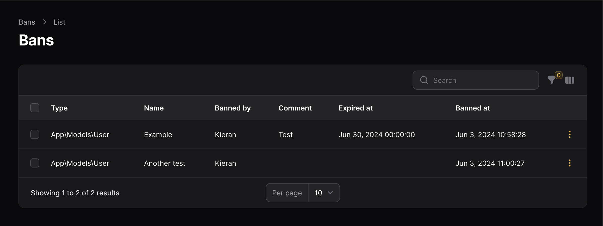
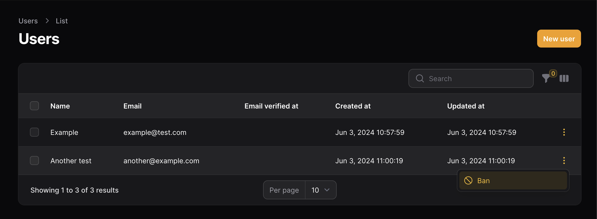
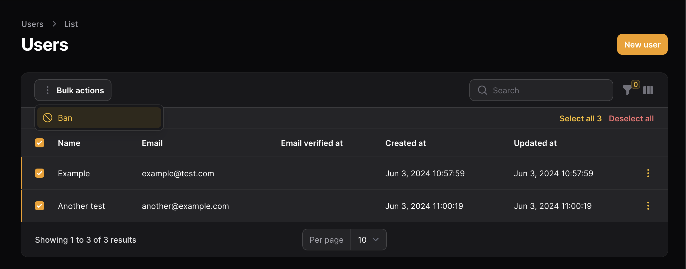
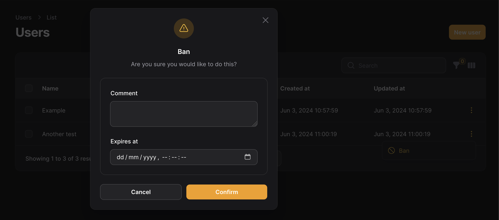
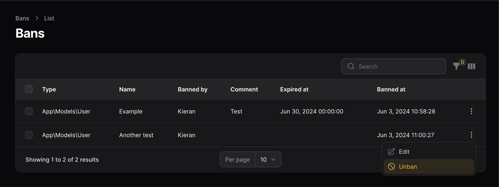
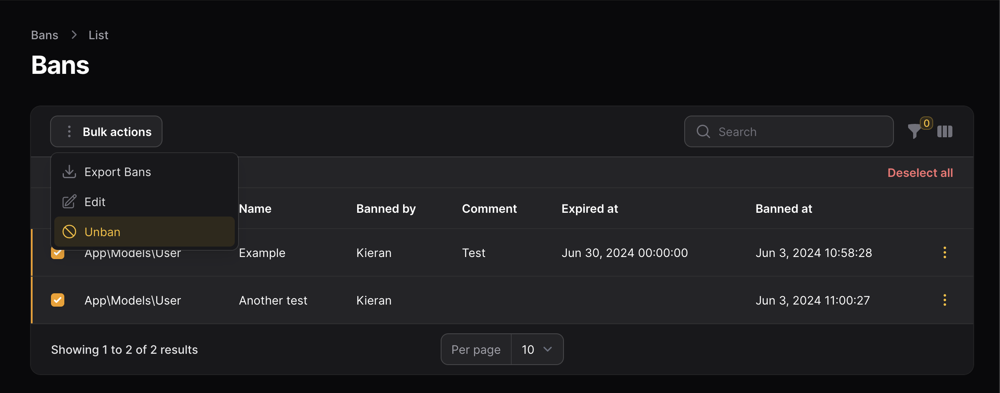
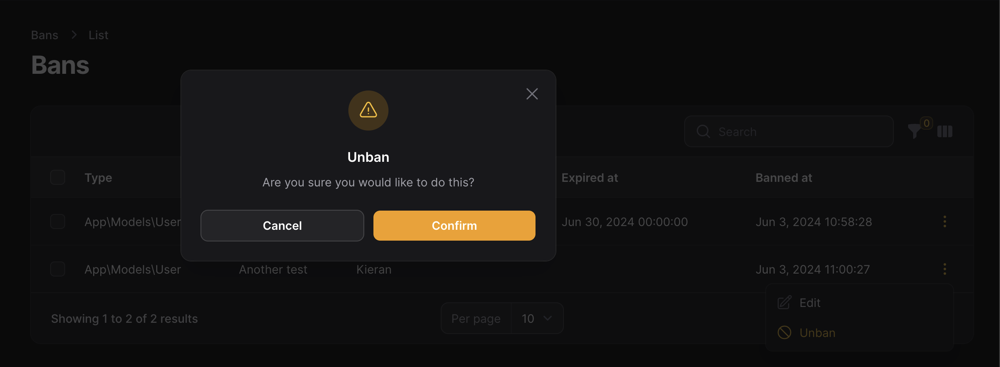

# Filament Banhammer

[](https://packagist.org/packages/gerenuk/filament-banhammer)
[](https://github.com/gerenuk-ltd/filament-banhammer/actions?query=workflow%3Arun-tests+branch%3Amain)
[](https://github.com/gerenuk-ltd/filament-banhammer/actions?query=workflow%3A"Fix+PHP+code+style+issues"+branch%3Amain)
[](https://packagist.org/packages/gerenuk/filament-banhammer)
[](https://github.com/Gerenuk-LTD/filament-banhammer/blob/main/LICENSE.md)

This package uses [mchev/banhammer](https://github.com/mchev/banhammer) to add model banning functionality to filament.

## Table of Contents
1. [Introduction](#filament-banhammer)
2. [Version Compatibility](#version-compatibility)
3. [Usage](#usage)
    - [Registering the Plugin](#usage)
    - [Ban](#ban)
    - [Unban](#unban)
    - [Ban Bulk](#ban-bulk)
    - [Unban Bulk](#unban-bulk)
4. [Testing](#testing)
5. [Screenshots](#screenshots)
    - [Resource](#resource)
    - [Ban Action](#ban-action)
    - [Ban Bulk Action](#ban-bulk-action)
    - [Ban Modal](#ban-modal)
    - [Unban Action](#unban)
    - [Unban Bulk Action](#unban-bulk)
    - [Unban Modal](#unban-modal)
6. [Changelog](#changelog)
7. [Contributing](#contributing)
8. [Security Vulnerabilities](#security-vulnerabilities)
9. [Credits](#credits)
10. [License](#license)

## Version Compatibility

| Plugin | Filament | Laravel | PHP      |
| ---------- | ---------- | ---------- |----------|
| 1.x | 3.x | 10.x | 8.x      |
| 1.x | 3.x | 11.x | 8.2\|8.3 |

## Installation

This package depends on [mchev/banhammer](https://github.com/mchev/banhammer) please follow the install guide there first.

You can install the package via composer:

```bash
composer require gerenuk/filament-banhammer
```

You can publish the config file with:

```bash
php artisan vendor:publish --tag="filament-banhammer-config"
```

This is the contents of the published config file:

<details>
  <summary>Click to expand!</summary>

    return [
    
        /*
         * The name of the resource which the plugin should use.
         */
        'resource' => \Gerenuk\FilamentBanhammer\Resources\BanhammerResource::class,
    
        /*
         * Whether an export action should be included on the resource.
         */
        'show_export' => true,
    
        /*
         * Options for the actions.
         */
        'actions' => [
    
            /*
             * Options for the ban action.
             */
            'ban' => [
    
                /*
                 * The title of the ban action.
                 */
                'label' => 'ban',
    
                /*
                 * The colour of the ban action.
                 */
                'colour' => 'warning',
    
                /*
                 * The symbol of the ban action.
                 */
                'icon' => 'heroicon-o-no-symbol',
    
                /*
                 * Whether confirming is required when using the ban action.
                 */
                'require_confirmation' => true,
    
                /*
                 * Notification options for the ban action.
                 */
                'notifications' => [
    
                    /*
                     * Whether a notification should be shown for the ban action.
                     */
                    'show' => true,
    
                    /*
                     * Success options for the ban action notifications.
                     */
                    'success' => [
    
                        /*
                        * The title of the success notification for the ban action.
                        */
                        'title' => 'Banned',
    
                    ],
    
                    /*
                     * Error options for the ban action notifications.
                     */
                    'error' => [
    
                        /*
                        * The title of the error notification for the ban action.
                        */
                        'title' => 'Failed',
    
                    ],
    
                ],
    
            ],
    
            /*
             * Options for the edit ban action.
             */
            'edit_ban' => [
    
                /*
                 * The title of the edit ban action.
                 */
                'label' => 'edit ban',
    
                /*
                 * The colour of the edit ban action.
                 */
                'colour' => 'warning',
    
                /*
                 * The symbol of the edit ban action.
                 */
                'icon' => 'heroicon-o-pencil-square',
    
                /*
                 * Whether confirming is required when using the edit ban action.
                 */
                'require_confirmation' => true,
    
                /*
                 * Notification options for the edit ban action.
                 */
                'notifications' => [
    
                    /*
                     * Whether a notification should be shown for the edit ban action.
                     */
                    'show' => true,
    
                    /*
                     * Success options for the edit ban action notifications.
                     */
                    'success' => [
    
                        /*
                        * The title of the success notification for the edit ban action.
                        */
                        'title' => 'Saved',
    
                    ],
    
                    /*
                     * Error options for the edit ban action notifications.
                     */
                    'error' => [
    
                        /*
                        * The title of the error notification for the edit ban action.
                        */
                        'title' => 'Failed',
    
                    ],
    
                ],
    
            ],
    
            /*
             * Options for the unban action.
             */
            'unban' => [
    
                /*
                 * The title of the unban action.
                 */
                'label' => 'unban',
    
                /*
                 * The colour of the unban action.
                 */
                'colour' => 'warning',
    
                /*
                 * The symbol of the unban action.
                 */
                'icon' => 'heroicon-o-no-symbol',
    
                /*
                 * Whether confirming is required when using the unban action.
                 */
                'require_confirmation' => true,
    
                /*
                 * Notification options for the unban action.
                 */
                'notifications' => [
    
                    /*
                     * Whether a notification should be shown for the unban action.
                     */
                    'show' => true,
    
                    /*
                     * Success options for the unban action notifications.
                     */
                    'success' => [
    
                        /*
                        * The title of the success notification for the unban action.
                        */
                        'title' => 'Unbanned',
    
                    ],
    
                    /*
                     * Error options for the unban action notifications.
                     */
                    'error' => [
    
                        /*
                        * The title of the error notification for the unban action.
                        */
                        'title' => 'Failed',
    
                    ],
    
                ],
    
            ],
    
            /*
             * Options for the ban bulk action.
             */
            'ban_bulk' => [
    
                /*
                 * The title of the ban bulk action.
                 */
                'label' => 'ban',
    
                /*
                 * The colour of the ban bulk action.
                 */
                'colour' => 'warning',
    
                /*
                 * The symbol of the ban bulk action.
                 */
                'icon' => 'heroicon-o-no-symbol',
    
                /*
                 * Whether confirming is required when using the ban bulk action.
                 */
                'require_confirmation' => true,
    
                /*
                 * Notification options for the ban bulk action.
                 */
                'notifications' => [
    
                    /*
                     * Whether a notification should be shown for the ban bulk action.
                     */
                    'show' => true,
    
                    /*
                     * Success options for the ban bulk action notifications.
                     */
                    'success' => [
    
                        /*
                        * The title of the success notification for the ban bulk action.
                        */
                        'title' => 'Banned',
    
                    ],
    
                    /*
                     * Error options for the ban bulk action notifications.
                     */
                    'error' => [
    
                        /*
                        * The title of the error notification for the ban bulk action.
                        */
                        'title' => 'Failures',
    
                    ],
    
                ],
    
            ],
    
            /*
             * Options for the edit ban bulk action.
             */
            'edit_ban_bulk' => [
    
                /*
                 * The title of the edit ban bulk action.
                 */
                'label' => 'edit ban',
    
                /*
                 * The colour of the edit ban bulk action.
                 */
                'colour' => 'warning',
    
                /*
                 * The symbol of the edit ban bulk action.
                 */
                'icon' => 'heroicon-o-pencil-square',
    
                /*
                 * Whether confirming is required when using the edit ban bulk action.
                 */
                'require_confirmation' => true,
    
                /*
                 * Notification options for the edit ban bulk action.
                 */
                'notifications' => [
    
                    /*
                     * Whether a notification should be shown for the edit ban bulk action.
                     */
                    'show' => true,
    
                    /*
                     * Success options for the edit ban bulk action notifications.
                     */
                    'success' => [
    
                        /*
                        * The title of the success notification for the edit ban bulk action.
                        */
                        'title' => 'Saved',
    
                    ],
    
                    /*
                     * Error options for the edit ban bulk action notifications.
                     */
                    'error' => [
    
                        /*
                        * The title of the error notification for the edit ban bulk action.
                        */
                        'title' => 'Failures',
    
                    ],
    
                ],
    
            ],
    
            /*
             * Options for the unban bulk action.
             */
            'unban_bulk' => [
    
                /*
                 * The title of the unban bulk action.
                 */
                'label' => 'unban',
    
                /*
                 * The colour of the unban bulk action.
                 */
                'colour' => 'warning',
    
                /*
                 * The symbol of the unban bulk action.
                 */
                'icon' => 'heroicon-o-no-symbol',
    
                /*
                 * Whether confirming is required when using the unban bulk action.
                 */
                'require_confirmation' => true,
    
                /*
                 * Notification options for the unban bulk action.
                 */
                'notifications' => [
    
                    /*
                     * Whether a notification should be shown for the unban bulk action.
                     */
                    'show' => true,
    
                    /*
                     * Success options for the unban bulk action notifications.
                     */
                    'success' => [
    
                        /*
                        * The title of the success notification for the unban bulk action.
                        */
                        'title' => 'Unbanned',
    
                    ],
    
                    /*
                     * Error options for the unban bulk action notifications.
                     */
                    'error' => [
    
                        /*
                        * The title of the error notification for the unban bulk action.
                        */
                        'title' => 'Failures',
    
                    ],
    
                ],
    
            ],
    
        ],
    
    ];
</details>

## Usage

You first need to register the plugin with Filament. This can be done inside of your `PanelProvider`, e.g. `AdminPanelProvider`.

```php
<?php

namespace App\Providers\Filament;

use Filament\Panel;
use Filament\PanelProvider;
use Gerenuk\FilamentBanhammer\FilamentBanhammerPlugin;

class AdminPanelProvider extends PanelProvider
{
    public function panel(Panel $panel): Panel
    {
        return $panel
            // ...
            ->plugin(FilamentBanhammerPlugin::make());
    }
}
```
For each model you have added the `use Banhammer` trait to, you will also need to add the following method:

```php
public function getFilamentBanhammerTitleAttribute()
{
    return $this->name;
}
```
> [!IMPORTANT]
> This specifies which property to be displayed in the bans resource.

### Ban

To be able to ban a resource simply add the `Ban` action:

```php
use Filament\Tables\Table;
use Gerenuk\FilamentBanhammer\Resources\Actions\BanAction;

public static function table(Table $table): Table
    {
        return $table
            ->columns([
                // ...
            ])
            ->actions([
                BanAction::make(),
            ]);
    }
```

### Unban

To be able to unban a resource simply add the `Unban` action:

```php
use Filament\Tables\Table;
use Gerenuk\FilamentBanhammer\Resources\Actions\UnbanAction;

public static function table(Table $table): Table
    {
        return $table
            ->columns([
                // ...
            ])
            ->actions([
                UnbanAction::make(),
            ]);
    }
```
> A ban resource is included by default if you would prefer to use that instead.

### Ban Bulk

To be able to bulk ban a resource simply add the `BanBulk` action:

```php
use Filament\Tables\Table;
use Gerenuk\FilamentBanhammer\Resources\Actions\BanBulkAction;

public static function table(Table $table): Table
    {
        return $table
            ->columns([
                // ...
            ])
            ->bulkActions([
                BanBulkAction::make(),
            ]);
    }
```

### Unban Bulk

To be able to bulk unban a resource simply add the `UnbanBulk` action:

```php
use Filament\Tables\Table;
use Gerenuk\FilamentBanhammer\Resources\Actions\UnbanBulkAction;

public static function table(Table $table): Table
    {
        return $table
            ->columns([
                // ...
            ])
            ->bulkActions([
                UnbanBulkAction::make(),
            ]);
    }
```
> A ban resource is included by default if you would prefer to use that instead.

## Testing

```bash
composer test
```

## Screenshots

### Resource



### Ban Action



### Ban Bulk Action



### Ban Modal



### Unban Action



### Unban Bulk Action



### Unban Modal



## Changelog

Please see [CHANGELOG](CHANGELOG.md) for more information on what has changed recently.

## Contributing

Please see [CONTRIBUTING](CONTRIBUTING.md) for details.

## Security Vulnerabilities

Please review [our security policy](../../security/policy) on how to report security vulnerabilities.

## Credits

- Based on [laravel-banhammer](https://github.com/mchev/banhammer) from [mchev](https://github.com/mchev)
- [Kieran Proctor](https://github.com/KieranLProctor)
- [All Contributors](../../contributors)

## License

The MIT License (MIT). Please see [License File](LICENSE.md) for more information.
